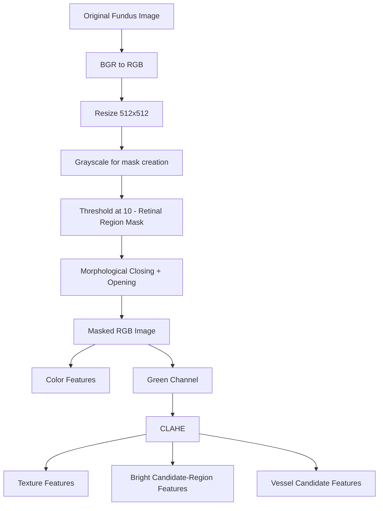

# Interpretable Diabetic Retinopathy Grading from Fundus Images

> **Project status:** Work in progress. The image-preprocessing and feature-extraction stages are implemented and the processed feature matrices are generated. Model training and evaluation are under active development, and **no final performance results are reported yet**.

---

## Overview

This project builds an **interpretable, classical computer-vision + machine-learning pipeline** for grading diabetic retinopathy (DR) severity from retinal fundus photographs.

Instead of training an end-to-end deep network, each fundus image is converted into a small set of **27 hand-crafted numerical features** derived from standard image-processing operations. Each feature has a direct, human-readable meaning (e.g. average color intensity, texture contrast, fraction of the retina covered by bright candidate regions). These features are intended to be used with a **Support Vector Machine (SVM)** classifier.

| Item | Description |
|---|---|
| Dataset | IDRiD — Indian Diabetic Retinopathy Image Dataset, subset **B. Disease Grading** |
| Target | Retinopathy Grade (RG), 5 classes (0–4) |
| Approach | Classical image processing → hand-crafted features → SVM |
| Features | 27 numerical features per image across 4 families (color, texture, candidate-region morphology, vessel candidates) |

This is a research and learning project. It is **not** a medical device, and none of the features described here should be interpreted as clinically validated or diagnostic.

---

## Research Question

> *Can interpretable image-processing-derived retinal features extracted from fundus photographs be used with a classical SVM to classify diabetic retinopathy severity from Grade 0 to Grade 4?*

**Scope:** The project addresses **Retinopathy Grade classification only**. Although the IDRiD grading labels also include a Risk of Macular Edema column, macular edema / DME classification is outside the scope of this project.

---

## Dataset

The project uses the **B. Disease Grading** subset of the [IDRiD dataset](https://idrid.grand-challenge.org/), which provides colour fundus photographs with image-level retinopathy grades.

| Grade | Meaning |
|---|---|
| 0 | No DR |
| 1 | Mild non-proliferative DR |
| 2 | Moderate non-proliferative DR |
| 3 | Severe non-proliferative DR |
| 4 | Proliferative DR |

### Official train/test split

The official split provided by IDRiD is used **unchanged**: 413 training images and 103 testing images (516 total).

| Grade | Training | Testing | Total | Share of total |
|---|---:|---:|---:|---:|
| 0 — No DR | 134 | 34 | 168 | 32.6% |
| 1 — Mild | 20 | 5 | 25 | 4.8% |
| 2 — Moderate | 136 | 32 | 168 | 32.6% |
| 3 — Severe | 74 | 19 | 93 | 18.0% |
| 4 — Proliferative | 49 | 13 | 62 | 12.0% |
| **Total** | **413** | **103** | **516** | 100% |

### Class imbalance

The dataset is strongly imbalanced. **Grade 1 (Mild)** is the most under-represented class, with only 20 training images and 5 test images. With so few test examples, per-class metrics for Grade 1 will be highly unstable (a single prediction changes Grade 1 test recall by 20 percentage points). Overall accuracy alone is therefore not an adequate summary for this task, and any future evaluation should report per-class and imbalance-aware metrics.

---

## Methodology

High-level pipeline:

```
Original fundus image
        │
        ▼
Resize to 512 × 512
        │
        ▼
Retinal-region mask  (grayscale threshold)
        │
        ▼
Morphological cleaning  (closing + opening)
        │
        ▼
Apply retinal mask
        │
        ▼
Masked RGB image
        ├──────────────► Color / intensity features        (9)
        │
        └──► Green channel
                │
                ▼
              CLAHE
                │
                ▼
      Green enhanced image
          ├──► Texture features (GLCM)                    (4)
          ├──► Bright candidate-region features            (9)
          └──► Vessel candidate features                   (5)
                                                          ────
                                             27 features per image
                                                          │
                                                          ▼
                                             SVM classifier (in progress)
                                                          │
                                                          ▼
                                             Retinopathy Grade 0–4
```

---

## Image Preprocessing

Implemented in [`src/preprocessing/image_preprocessing.py`](src/preprocessing/image_preprocessing.py).



Each step below lists **what the code does** and, separately, **why** this kind of step is commonly used in fundus image processing.

| # | Step | What the code does | General motivation |
|---|---|---|---|
| 1 | Load image | Reads the image with OpenCV (`cv2`). | Standard image I/O. |
| 2 | Color conversion | Converts OpenCV's default **BGR** channel order to **RGB**. | Ensures channel-wise features (e.g. `mean_r`) refer to the correct color channel. |
| 3 | Resize | Resizes every image to **512 × 512** pixels. | IDRiD images are high resolution; a common size makes feature values comparable across images and reduces computation. Note that pixel-count features (areas) are measured in this resized space. |
| 4 | Grayscale | Converts the RGB image to grayscale, used **only** to build the retinal mask. | A single intensity channel is sufficient to separate the bright circular retina from the dark background. |
| 5 | Retinal-region mask | Thresholds the grayscale image at a value of **10** to produce a binary mask. | Fundus photographs have a near-black border outside the circular field of view. Isolating the field of view prevents that background from distorting statistics. |
| 6 | Mask cleaning | Applies **morphological closing** followed by **morphological opening** to the binary mask. | Closing fills small holes and gaps inside the retinal region; opening removes small isolated noise pixels outside it. |
| 7 | Apply mask | Multiplies/masks the RGB image with the cleaned mask. | Restricts subsequent analysis to the retinal field of view. |
| 8 | Green channel | Extracts the green channel of the masked RGB image. | In fundus photography the green channel generally offers the best contrast for retinal structures such as vessels and bright/dark spots; red is often saturated and blue is often noisy. |
| 9 | CLAHE | Applies **CLAHE** (Contrast Limited Adaptive Histogram Equalization) to the green channel, producing the *green enhanced* image. | CLAHE enhances **local** contrast while limiting noise amplification, making structures easier to characterize numerically. CLAHE is a contrast-enhancement step; it does **not** detect lesions. |

---

## Feature Extraction

Implemented in [`src/features/feature_extraction.py`](src/features/feature_extraction.py).

Four feature families are extracted, giving **27 numerical features per image**.

| Family | Source image | # Features |
|---|---|---:|
| Color / intensity | Masked RGB | 9 |
| Texture (GLCM) | CLAHE-enhanced green | 4 |
| Bright candidate-region morphology | CLAHE-enhanced green | 9 |
| Vessel candidates | CLAHE-enhanced green | 5 |
| **Total** | | **27** |

### 1. Color / intensity features (9)

Computed from the masked RGB image. These are **global statistical descriptors** of retinal color and brightness for each channel.

| Feature | Description |
|---|---|
| `mean_r`, `mean_g`, `mean_b` | Mean intensity of the red, green and blue channels |
| `std_r`, `std_g`, `std_b` | Standard deviation of each channel (spread / variability of intensity) |
| `median_r`, `median_g`, `median_b` | Median intensity of each channel (robust central value, less sensitive to outliers) |

These features summarise the image as a whole. They are also sensitive to acquisition factors such as illumination, camera settings and pigmentation, not only to retinal pathology.

### 2. Texture features (4)

Computed from the CLAHE-enhanced green channel using a **Gray-Level Co-occurrence Matrix (GLCM)**.

**GLCM concept.** A GLCM counts how often a pixel with gray level *i* occurs next to a pixel with gray level *j* at a given distance and direction. Statistics of this matrix describe the spatial arrangement of intensities, i.e. texture.

Current configuration:

| Parameter | Value |
|---|---|
| Quantization | Green-enhanced intensities divided by 32 → approximately **8 gray levels** |
| Distance | 1 pixel |
| Angle | 0 (horizontal neighbours) |
| Symmetric | True |
| Normalized | True |

Quantizing to 8 levels keeps the matrix small and the statistics stable.

| Feature | What it represents |
|---|---|
| `glcm_contrast` | Weighted by the squared difference between neighbouring gray levels; high when neighbouring pixels differ strongly |
| `glcm_dissimilarity` | Similar to contrast, but weighted linearly by the gray-level difference |
| `glcm_homogeneity` | High when neighbouring pixels have similar gray levels (co-occurrences concentrated near the diagonal) |
| `glcm_energy` | Measures uniformity / orderliness of the co-occurrence distribution; high when a few gray-level pairs dominate |

These are general texture descriptors. They are **not** specific detectors of diabetic lesions. Because a single direction (0°) is used, they capture horizontal texture only.

### 3. Morphological / bright candidate-region features (9)

A binary **candidate mask** is created by thresholding the CLAHE-enhanced green channel:

```
candidate_mask = (green_enhanced > 180) AND retinal_mask
```

Connected-component analysis is then applied to the candidate mask, and shape/size statistics are computed over the resulting regions.

> **Terminology:** These regions are referred to as **bright candidate regions** (or candidate abnormal regions). They are **not** confirmed lesions. The pipeline does not verify that any region corresponds to an exudate or other pathological finding.

| Feature | Description |
|---|---|
| `candidate_area` | Total number of pixels in the candidate mask |
| `candidate_area_ratio` | Candidate area divided by retinal-region area, i.e. the fraction of the field of view flagged as bright candidate |
| `num_regions` | Number of connected candidate regions |
| `largest_region_area` | Pixel area of the largest candidate region |
| `mean_region_area` | Mean pixel area of the candidate regions |
| `std_region_area` | Standard deviation of candidate-region areas (size variability) |
| `mean_aspect_ratio` | Mean elongation of regions (ratio of region width to height); values far from 1 indicate elongated shapes |
| `mean_circularity` | Mean circularity, conventionally 4π·Area / Perimeter²; equals 1 for a perfect circle and decreases for irregular or elongated shapes |
| `mean_solidity` | Mean ratio of region area to convex-hull area; low values indicate irregular, concave or fragmented shapes |

**Limitation.** A fixed brightness threshold also captures bright **normal anatomical structures**, most notably the **optic disc**, as well as illumination artefacts, reflections and bright regions near the field-of-view edge. These features are therefore **image-derived candidate-region descriptors**, not clinically verified lesion measurements. A fixed threshold of 180 may also behave differently across images with different overall brightness.

### 4. Vessel candidate features (5)

A candidate vessel mask is computed from the CLAHE-enhanced green channel:

```
green_enhanced
      │
      ▼
15 × 15 elliptical structuring element
      │
      ▼
Black-hat transform
      │
      ▼
Otsu threshold
      │
      ▼
Morphological opening
      │
      ▼
Candidate vessel mask
```

**What the black-hat transform does.** The black-hat transform is the difference between the morphological *closing* of an image and the image itself. Closing fills in dark structures that are smaller than the structuring element, so subtracting the original image leaves those **relatively dark, thin structures against a brighter local background**. Retinal vessels appear dark in the green channel, so this produces a **candidate representation** of the vasculature. Otsu's method then selects a global threshold automatically, and opening removes small noisy fragments.

| Feature | Description |
|---|---|
| `vessel_area` | Total number of pixels in the candidate vessel mask |
| `vessel_density` | Vessel area relative to the retinal-region area |
| `num_vessel_components` | Number of connected components in the candidate vessel mask |
| `mean_vessel_component_area` | Mean pixel area of these components |
| `std_vessel_component_area` | Standard deviation of component areas |

**Limitations.**
- This is a simple morphological approximation, **not a medically validated vessel segmentation algorithm**. It may include other dark structures (e.g. dark lesions, pigmentation, noise) and may miss faint or thin vessels.
- Connected components are **segmented candidate regions**. A vessel tree can be split into many components or merged with non-vessel structures, so `num_vessel_components` should **not** be read as the number of anatomical vessels.

---

## Processed Feature Matrices

Feature extraction produces two CSV files in `data/processed/`:

| File | Rows | Columns |
|---|---:|---|
| `idrid_feature_matrix.csv` (training) | 413 | 27 features + `image_id` + `Retinopathy grade` = **29** |
| `idrid_test_feature_matrix.csv` (testing) | 103 | 27 features + `image_id` + `Retinopathy grade` = **29** |

- **`image_id`** is an identifier used to trace each row back to its image. It is **not** a model feature.
- **`Retinopathy grade`** is the **target label**. It is **not** a model feature.
- The model input is therefore **X_train: 413 × 27** and **X_test: 103 × 27**.

---

## Classification

**Status: in progress.**

The extracted features are intended to be used with a **Support Vector Machine (SVM)** to predict Retinopathy Grade 0–4, trained on the official training set and evaluated on the official test set. Model training is being developed in `notebooks/model_training.ipynb`.

Hyperparameters, feature scaling, class-imbalance handling and the final evaluation protocol will be documented here once finalized.

---

## Results

**No results are reported yet.** This section will be updated once model training and evaluation are complete. Planned reporting includes per-class metrics and a confusion matrix, given the class imbalance described above.

---

## Repository Structure

```
aiml_biodata/
├── README.md
├── requirements.txt
├── .gitignore
├── data/
│   ├── raw/
│   │   └── IDRiD/
│   │       └── B. Disease Grading/
│   │           ├── 1. Original Images/
│   │           │   ├── a. Training Set/
│   │           │   └── b. Testing Set/
│   │           └── 2. Groundtruths/
│   │               ├── a. IDRiD_Disease Grading_Training Labels.csv
│   │               └── b. IDRiD_Disease Grading_Testing Labels.csv
│   └── processed/
│       ├── idrid_feature_matrix.csv
│       └── idrid_test_feature_matrix.csv
├── notebooks/
│   ├── 01_eda.ipynb                 # Exploratory data analysis
│   ├── image_preprocessing.ipynb    # Preprocessing development / visualization
│   ├── feature_extraction.ipynb     # Feature extraction development
│   ├── feature_matrix.ipynb         # Builds the processed feature CSVs
│   └── model_training.ipynb         # SVM training (in progress)
├── src/
│   ├── preprocessing/
│   │   └── image_preprocessing.py   # Preprocessing pipeline
│   ├── features/
│   │   └── feature_extraction.py    # 27-feature extraction
│   ├── models/                      # (in progress)
│   └── evaluation/                  # (in progress)
└── results/
    ├── figures/
    └── tables/
```

---

## Getting Started

### 1. Install dependencies

```bash
pip install -r requirements.txt
```

### 2. Obtain the dataset

Download IDRiD from the [official challenge page](https://idrid.grand-challenge.org/) and place the **B. Disease Grading** folder at:

```
data/raw/IDRiD/B. Disease Grading/
```

The raw images are not included in this repository. Please follow the dataset's licence and terms of use.

### 3. Run the notebooks

Run the notebooks in this order:

1. `01_eda.ipynb`
2. `image_preprocessing.ipynb`
3. `feature_extraction.ipynb`
4. `feature_matrix.ipynb` → writes the processed CSVs to `data/processed/`
5. `model_training.ipynb` (in progress)

---

## Limitations

- **Not a diagnostic tool.** Features are image-derived descriptors and are not medically validated. No feature is claimed to be diagnostic of, or causally related to, retinopathy severity.
- **Candidate regions are not lesions.** Bright candidate regions can include the optic disc and illumination artefacts; vessel candidates can include non-vessel dark structures.
- **Fixed thresholds.** The retinal mask (10) and bright candidate (180) thresholds are fixed and may not generalize equally well across images with different brightness or contrast.
- **Single-direction texture.** GLCM features use one distance and one angle (0°) only.
- **Global descriptors.** Features summarise the whole retina and do not encode where findings are located.
- **Class imbalance and small test set.** Grade 1 has 5 test images, so per-class estimates for it will be unreliable.
- **Single dataset.** All data come from IDRiD; behaviour on other cameras or populations has not been assessed.

---

## Acknowledgements and Citation

This project uses the IDRiD dataset. If you use this work, please cite the original dataset:

> Porwal, P., Pachade, S., Kamble, R., Kokare, M., Deshmukh, G., Sahasrabuddhe, V., & Meriaudeau, F. (2018). *Indian Diabetic Retinopathy Image Dataset (IDRiD): A Database for Diabetic Retinopathy Screening Research.* Data, 3(3), 25.