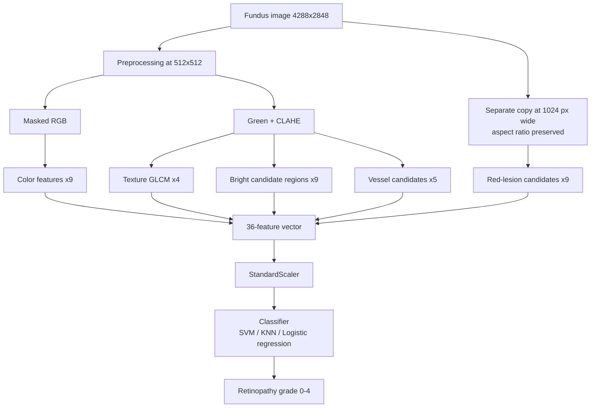
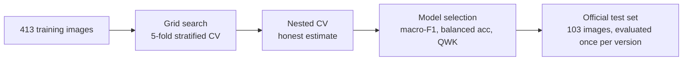
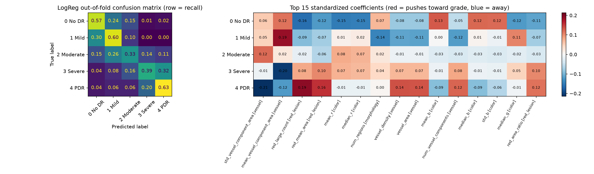

<a id="top"></a>

# Interpretable Diabetic Retinopathy Grading from Fundus Images

**Classical computer vision + machine learning for 5-class diabetic retinopathy grading on IDRiD, built from human-readable image features.**


> [!IMPORTANT]
> This is a research and learning project. It is **not a medical device** and must not be used for diagnosis. "Candidate regions" in this project are image-derived candidates, not clinically verified lesions.

---

## Contents

| | Section | What you'll find |
|---|---|---|
| 1 | [Overview](#overview) | What the project does, in one minute |
| 2 | [Key findings](#key-findings) | The results that matter, summarized |
| 3 | [Dataset](#dataset) | IDRiD grading subset, split, class imbalance |
| 4 | [Pipeline](#pipeline) | End-to-end flow from image to grade |
| 5 | [Image preprocessing](#image-preprocessing) | Mask, green channel, CLAHE |
| 6 | [Features](#features) | All 36 features in 5 families |
| 7 | [Modeling](#modeling) | Normalization, imbalance handling, model search |
| 8 | [Evaluation protocol](#evaluation-protocol) | CV, nested CV, metrics, test-set policy |
| 9 | [Results](#results) | Cross-validation, test set, interpretability |
| 10 | [Context: IDRiD challenge](#context-idrid-challenge) | How this compares to published entries |
| 11 | [Limitations](#limitations) | What the results do and do not show |
| 12 | [Repository structure](#repository-structure) | Where everything lives |
| 13 | [How to run](#how-to-run) | Reproduce the pipeline step by step |
| 14 | [Next steps](#next-steps) | Planned improvements |
| 15 | [Credits and citation](#credits-and-citation) | Dataset owners and references |

---

## Overview

**Research question**

> *Can interpretable image-processing-derived retinal features extracted from fundus photographs be used with classical machine learning to classify diabetic retinopathy severity from Grade 0 to Grade 4?*

Each fundus photograph is converted into **36 numerical features** that each have a direct meaning (for example, average color intensity, how much of the retina is covered by bright regions, how many small dark spots are present). These features are then classified with standard scikit-learn models: SVM, k-nearest neighbours and logistic regression.

**Target: Retinopathy Grade only.** Macular edema / DME grading is outside the scope of this project.

| Grade | Meaning |
|---|---|
| 0 | No DR |
| 1 | Mild non-proliferative DR |
| 2 | Moderate non-proliferative DR |
| 3 | Severe non-proliferative DR |
| 4 | Proliferative DR |

<p align="right"><a href="#top">↑ back to top</a></p>

---

## Key findings

1. **Interpretable features capture overall severity, but not fine grade steps.** Models reach a quadratic weighted kappa of about **0.67–0.70** in nested cross-validation, and around 78–80% of predictions fall within one grade of the truth. Exact 5-class accuracy stays around **0.49–0.55** in cross-validation.
2. **The features, not the classifier, set the ceiling.** Linear SVM, RBF SVM, Random Forest, KNN and logistic regression all land in a similar range on imbalance-aware metrics.
3. **Logistic regression is the best all-round model.** It scores highest on balanced accuracy (0.523), macro-F1 (0.462) and kappa (0.698) in nested CV, is the most stable across folds, and is the easiest to interpret.
4. **Red-lesion candidate features point in the clinically expected direction.** Larger and more numerous dark-spot candidates push predictions toward Grades 3–4 and away from Grade 0.
5. **Higher accuracy can be bought by ignoring rare grades.** KNN reaches the highest accuracy (0.547) but finds only 10% of Mild cases, which is why accuracy alone is not used for model selection.
6. **Test-set scores are lower than CV scores**, mostly because healthy (Grade 0) test images are often over-graded. This gap is consistent across runs and is still being investigated.

<p align="right"><a href="#top">↑ back to top</a></p>

---

## Dataset

**IDRiD — Indian Diabetic Retinopathy Image Dataset**, subset **B. Disease Grading**. Colour fundus photographs (4288 × 2848 px) with image-level grades. The **official train/test split is used unchanged.**

| Grade | Training | Testing | Total | Share |
|---|---:|---:|---:|---:|
| 0 — No DR | 134 | 34 | 168 | 32.6% |
| 1 — Mild | 20 | 5 | 25 | 4.8% |
| 2 — Moderate | 136 | 32 | 168 | 32.6% |
| 3 — Severe | 74 | 19 | 93 | 18.0% |
| 4 — Proliferative | 49 | 13 | 62 | 12.0% |
| **Total** | **413** | **103** | **516** | 100% |

> [!NOTE]
> **Strong class imbalance.** Grade 1 has only 20 training and 5 test images. A single test prediction changes Grade 1 test recall by 20 percentage points, so all per-class results for Grade 1 are highly uncertain.

The raw images are not included in this repository. See [How to run](#how-to-run) for where to place them.

<p align="right"><a href="#top">↑ back to top</a></p>

---

## Pipeline



<p align="right"><a href="#top">↑ back to top</a></p>

---

## Image preprocessing

Implemented in [`src/preprocessing/image_preprocessing.py`](src/preprocessing/image_preprocessing.py).

| # | Step | What the code does | Why |
|---|---|---|---|
| 1 | Load | Read with OpenCV, convert BGR → RGB | Correct channel order for color features |
| 2 | Resize | 512 × 512 pixels | Common size, faster processing |
| 3 | Retinal mask | Grayscale, threshold at **10** | Separate the circular retina from the black border |
| 4 | Mask cleaning | Morphological closing, then opening | Fill small holes, remove small noise in the mask |
| 5 | Apply mask | Keep only retinal pixels | Background must not distort statistics |
| 6 | Green channel | Extract green from masked RGB | Best contrast for vessels and lesions in fundus images |
| 7 | CLAHE | Local contrast enhancement of green | Makes structures easier to characterize; it is **not** lesion detection |

> [!NOTE]
> Resizing 4288 × 2848 images to 512 × 512 shrinks the width more than the height, so round structures become slightly oval. This is why the red-lesion family uses its own aspect-preserving copy (see below).

<p align="right"><a href="#top">↑ back to top</a></p>

---

## Features

Implemented in [`src/features/feature_extraction.py`](src/features/feature_extraction.py) and [`src/features/red_lesion_features.py`](src/features/red_lesion_features.py).

| Family | Source | Count | Captures |
|---|---|---:|---|
| Color / intensity | Masked RGB | 9 | Global color and brightness of the retina |
| Texture (GLCM) | Green + CLAHE | 4 | Local intensity variation |
| Bright candidate regions | Green + CLAHE | 9 | Size and shape of bright areas |
| Vessel candidates | Green + CLAHE | 5 | Amount and fragmentation of dark structures |
| Red-lesion candidates | Green, 1024 px | 9 | Small dark spots (microaneurysm- / hemorrhage-like) |
| **Total** | | **36** | |

Click a family to expand its definitions.

<details>
<summary><b>1. Color / intensity (9)</b></summary>

Computed over retinal pixels only: `mean_r`, `mean_g`, `mean_b`, `std_r`, `std_g`, `std_b`, `median_r`, `median_g`, `median_b`.

Global descriptors. They also depend on illumination, camera exposure and pigmentation, not only on disease.
</details>

<details>
<summary><b>2. Texture — GLCM (4)</b></summary>

The CLAHE-enhanced green channel is quantized to 8 gray levels (`// 32`). A gray-level co-occurrence matrix counts how often level *i* sits next to level *j* (distance 1, angle 0°, symmetric, normalized).

| Feature | Meaning |
|---|---|
| `glcm_contrast` | High when neighbouring pixels differ strongly |
| `glcm_dissimilarity` | Like contrast, but weighted linearly |
| `glcm_homogeneity` | High when neighbouring pixels are similar |
| `glcm_energy` | High when a few gray-level pairs dominate |

General texture descriptors, not lesion detectors. The GLCM is currently computed on the whole image, including the black background outside the retina (see [Limitations](#limitations)).
</details>

<details>
<summary><b>3. Bright candidate regions (9)</b></summary>

`candidate_mask = (green_enhanced > 180) AND retinal_mask`, then connected components (components under 5 px ignored).

| Feature | Meaning |
|---|---|
| `candidate_area` | Total candidate pixels |
| `candidate_area_ratio` | Candidate area / retinal area |
| `num_regions` | Number of candidate regions |
| `largest_region_area`, `mean_region_area`, `std_region_area` | Region size statistics |
| `mean_aspect_ratio` | Mean bounding-box width / height |
| `mean_circularity` | Mean 4π·Area / Perimeter² (1 = circle) |
| `mean_solidity` | Mean area / convex-hull area |

> [!WARNING]
> A fixed brightness threshold also captures the **optic disc** and illumination artefacts. In visual checks the largest region is typically the optic disc. These are candidate-region descriptors, not exudate measurements.
</details>

<details>
<summary><b>4. Vessel candidates (5)</b></summary>

`green_enhanced → black-hat (15×15 ellipse) → Otsu threshold → 3×3 opening`

The black-hat transform (closing minus image) highlights **dark structures on a brighter local background**, which produces a candidate vessel map.

| Feature | Meaning |
|---|---|
| `vessel_area` | Candidate vessel pixels |
| `vessel_density` | Vessel area / retinal area |
| `num_vessel_components` | Connected components in the mask |
| `mean_vessel_component_area`, `std_vessel_component_area` | Component size statistics |

> [!WARNING]
> Not a validated vessel segmentation. The mask also picks up other dark structures, including dark lesions, and components are segmented pieces, not individual anatomical vessels.
</details>

<details>
<summary><b>5. Red-lesion candidates (9)</b></summary>

Small, compact regions darker than their local background, the appearance of microaneurysm- and hemorrhage-like spots.

1. **Resolution:** separate copy resized to 1024 px wide, aspect ratio preserved (microaneurysms shrink to 1–3 px at 512 × 512).
2. **Shade correction:** background estimated with a 61 px median blur; `darkness = background − pixel`, so detection is relative to local brightness.
3. **Per-image threshold:** robust z-score (median / MAD) of darkness; pixels with z > 3 are dark candidates. The outer 15 px of the retina are excluded (vignetting).
4. **Shape filter:** keep components of 3–3000 px; for components ≥ 10 px, reject elongation > 3 (vessel-like) or solidity < 0.5.

| Feature | Meaning |
|---|---|
| `red_count` | Number of candidates |
| `red_small_count` | Candidates ≤ 50 px (microaneurysm-sized) |
| `red_large_count` | Candidates > 50 px (hemorrhage-sized) |
| `red_total_area`, `red_area_ratio`, `red_mean_area` | Candidate area statistics |
| `red_mean_contrast` | Mean darkness of candidates (robust z units) |
| `red_quadrant_min_count` | Candidates in the least-affected image quadrant |
| `red_quadrants_over_thresh` | Image quadrants with ≥ 5 candidates |

Quadrants are image quadrants around the retina's centre, not anatomical quadrants. All parameters are starting values set by visual inspection; candidates are **not** validated against lesion annotations yet. Use [`notebooks/feature_visualization.ipynb`](notebooks/feature_visualization.ipynb) to inspect them.
</details>

**Stored feature matrices** (`data/processed/`):

| File | Rows | Columns |
|---|---:|---|
| `idrid_feature_matrix.csv` | 413 | `image_id` + 36 features + `Retinopathy grade` |
| `idrid_test_feature_matrix.csv` | 103 | same columns |

`image_id` is an identifier and `Retinopathy grade` is the target; neither is used as a model input.

<p align="right"><a href="#top">↑ back to top</a></p>

---

## Modeling

Implemented in [`notebooks/model_training.ipynb`](notebooks/model_training.ipynb).

**Normalization.** Features range from about 0.01 (ratios) to thousands (pixel areas). All models are distance- or weight-based, so `StandardScaler` (zero mean, unit variance) is applied **inside the pipeline**: it is fitted on the training part of each fold only, so no information leaks from validation data.

**Class imbalance.**

| Measure | Purpose |
|---|---|
| `class_weight="balanced"` (SVM, logistic regression) | Errors on rare grades cost more (Grade 1 weight ≈ 4.1, Grades 0/2 ≈ 0.6) |
| Unweighted variant also searched | Measures the effect instead of assuming it |
| Stratified folds | Every fold keeps the class proportions |
| Selection by macro-F1 | Every grade counts equally |
| No SMOTE | With 20 Mild images, synthetic samples would be interpolated from very few real ones |

**Models compared**

| Model | Search space |
|---|---|
| SVM | kernel (linear, RBF), `C`, `gamma`, class weighting, top-k features (ANOVA F: all, 10, 15, 20, 25) |
| KNN | `n_neighbors` (3–31), uniform vs distance weighting, Manhattan vs Euclidean |
| Logistic regression | `C` (0.001–100), balanced class weights, multinomial |

Earlier diagnostic runs also used a Random Forest as a reference model.

<p align="right"><a href="#top">↑ back to top</a></p>

---

## Evaluation protocol



| Metric | Why it is used |
|---|---|
| Accuracy | Standard, but dominated by Grades 0 and 2 |
| Balanced accuracy | Mean per-grade recall |
| Macro-F1 | Every grade weighted equally; used for model selection |
| Quadratic weighted kappa (QWK) | Ordinal agreement: predicting 3 for a true 4 is penalized less than predicting 0 |
| Within-one-grade rate | Share of predictions at most one grade off |

**Nested cross-validation** repeats the full hyperparameter search inside each outer fold and scores the winner on data the search never saw. Plain grid-search scores are optimistic because they are the best of many configurations.

**Test-set policy.** The official test set is used only to report final results, never to choose models or features. Each version's test result is reported, including runs that did not improve.

<p align="right"><a href="#top">↑ back to top</a></p>

---

## Results

### Cross-validation (nested, 36 features)

| Model | Accuracy | Balanced acc. | Macro-F1 | QWK |
|---|---:|---:|---:|---:|
| Dummy (most frequent) | 0.329 | 0.200 | 0.099 | 0.000 |
| SVM | 0.492 ± 0.049 | 0.449 | 0.420 | 0.675 |
| KNN | **0.547** ± 0.050 | 0.427 | 0.424 | 0.678 |
| **Logistic regression** | 0.506 ± **0.035** | **0.523** | **0.462** | **0.698** |

± = standard deviation across outer folds. The dummy baseline is from plain 5-fold CV.

**Logistic regression (`C = 0.01`, balanced) is selected as the final model**: best on every imbalance-aware metric, most stable, and directly interpretable. KNN's higher accuracy comes from favouring Grades 0 and 2: it finds only 10% of Mild cases.

<details>
<summary><b>Per-grade results: logistic regression vs KNN (out-of-fold, training set)</b></summary>

| Grade | LogReg recall | LogReg precision | KNN recall | KNN precision |
|---|---:|---:|---:|---:|
| 0 No DR | 0.575 | 0.706 | 0.843 | 0.689 |
| 1 Mild | **0.600** | 0.135 | 0.100 | 0.667 |
| 2 Moderate | 0.331 | 0.549 | 0.618 | 0.538 |
| 3 Severe | 0.392 | 0.483 | 0.297 | 0.489 |
| 4 PDR | **0.633** | 0.425 | 0.429 | 0.467 |

Logistic regression finds most Mild cases but over-calls Mild: about a quarter of Grade 0 and Grade 2 images are predicted as Mild. Moderate (Grade 2), the middle class, is its weakest grade.
</details>

### Official test set (103 images)

| Version | Model | Features | Accuracy | Macro-F1 | QWK |
|---|---|---:|---:|---:|---:|
| v1 | SVM, linear, `C=100`, balanced | 27 | 0.388 | 0.365 | 0.566 |
| v2 | SVM, RBF, `C=1000`, `γ=0.001`, balanced, top-15 | 36 | 0.388 [0.291–0.485] | 0.364 [0.266–0.446] | 0.590 [0.449–0.710] |
| v3 | Logistic regression, `C=0.01`, balanced | 36 | *pending* | *pending* | *pending* |

Brackets: 95% bootstrap confidence intervals (2000 resamples). v2 balanced accuracy: 0.410 [0.289–0.541], within one grade: 0.777.

> [!NOTE]
> The intervals are wide: with 103 test images, v1 and v2 cannot be distinguished. Test scores are consistently lower than cross-validation scores, mainly because many **Grade 0** test images are predicted as Grades 1–2 (Grade 0 test recall 0.32–0.41 vs about 0.58–0.84 in CV). A train/test feature-distribution check is planned to test whether this reflects an acquisition difference (e.g. illumination), which would affect the color features most.

### Interpretability: what the model learned



Standardized logistic regression coefficients (change in a grade's log-odds per +1 standard deviation of a feature, relative to the other grades):

| Pattern | Observation | Interpretation (association, not causation) |
|---|---|---|
| Red-lesion candidates | `red_large_count`, `red_mean_area`, `red_area_ratio` push toward Grades 3–4, away from Grade 0 | More and larger hemorrhage-sized dark candidates go with higher severity, the clinically expected direction |
| Small red candidates | `red_small_count` is not among the 15 strongest features | Microaneurysm-sized candidates carry little signal yet, which fits their tiny size even at 1024 px |
| Vessel candidates | `vessel_density`, `vessel_area` push toward Grade 4 | Could reflect dark lesions captured by the black-hat mask or new vessel growth; the features cannot tell them apart |
| Color | Higher blue and lower red push toward Grade 0 | Possibly acquisition-related (illumination, camera) rather than disease-related |

Correlated features (e.g. `mean_b` and `median_b`) share weight, so patterns are read by feature family rather than single coefficients.

<details>
<summary><b>Earlier diagnostics (v1, 27 features, linear SVM)</b></summary>

**Model comparison (5-fold CV, tuned):**

| Model | Accuracy | Macro-F1 | QWK |
|---|---:|---:|---:|
| Linear SVM | 0.506 | 0.441 | 0.673 |
| RBF SVM | 0.513 | 0.437 | 0.684 |
| Random Forest | 0.533 | 0.455 | 0.708 |

Three very different models reaching the same range was the first evidence that the features limit performance.

**Error distribution (out-of-fold):** 50.6% exact, 79.9% within one grade, 20.1% off by two or more.

**Feature-family ablation (macro-F1):**

| Setting | Macro-F1 |
|---|---:|
| All 27 features | 0.441 |
| Without color | 0.373 |
| Without vessel | 0.335 |
| Without morphology | 0.443 |
| Without texture | 0.449 |

Color and vessel features carried most of the signal; the bright-candidate (morphology) family added almost nothing, consistent with the optic disc dominating it.

**Binary sanity checks (diagnostic only, outside the project scope):**

| Task | Accuracy | Macro-F1 |
|---|---:|---:|
| No DR (0) vs DR (1–4) | 0.775 | 0.759 |
| Grades 0–1 vs 2–4 | 0.787 | 0.778 |

The features detect the presence of disease reasonably well; separating neighbouring grades is the hard part.

**Top-k feature selection** (inside the pipeline): k = 15 scored highest in grid search (macro-F1 0.463 vs 0.441 for all features), a difference within fold-to-fold variation.
</details>

<p align="right"><a href="#top">↑ back to top</a></p>

---

## Context: IDRiD challenge

For reference, the onsite results of the ISBI 2018 IDRiD grading sub-challenge report DR grading accuracies between **0.48 and 0.75** for the six ranked teams, mostly using deep learning ([leaderboard](https://idrid.grand-challenge.org/Leaderboard/), [challenge paper](https://doi.org/10.1016/j.media.2019.101561)). This project's goal is not to beat those systems, but to measure how far fully interpretable classical features can go on the same task. Protocols differ, so the comparison is indicative only.

<p align="right"><a href="#top">↑ back to top</a></p>

---

## Limitations

- **Not diagnostic.** No feature is claimed to be diagnostic of, or causally related to, retinopathy severity.
- **Unvalidated candidates.** Bright, vessel and red-lesion candidates have not been checked against lesion annotations.
- **Optic disc** dominates the bright-candidate family.
- **GLCM includes the background.** Texture features are computed on the full image, so part of what they measure is the black border and its edge.
- **Non-uniform resize** to 512 × 512 distorts shapes for the 512-px feature families.
- **Fixed thresholds** (mask 10, bright 180) may behave differently across images with different brightness.
- **Global descriptors.** Most features summarize the whole retina and lose where findings are located.
- **Acquisition sensitivity.** Color features may partly reflect illumination and camera differences.
- **Small data.** 413 training images (20 Mild), 103 test images; all estimates carry wide uncertainty.
- **Repeated test evaluation.** The test set has been evaluated for more than one version. All runs are reported, and model choices were made from cross-validation only.

<p align="right"><a href="#top">↑ back to top</a></p>

---

## Repository structure

```
aiml_biodata/
├── README.md
├── requirements.txt
├── .gitignore
├── data/
│   ├── raw/IDRiD/B. Disease Grading/          # not tracked: download separately
│   │   ├── 1. Original Images/
│   │   │   ├── a. Training Set/
│   │   │   └── b. Testing Set/
│   │   └── 2. Groundtruths/
│   │       ├── a. IDRiD_Disease Grading_Training Labels.csv
│   │       └── b. IDRiD_Disease Grading_Testing Labels.csv
│   └── processed/
│       ├── idrid_feature_matrix.csv           # 413 x (36 features + id + grade)
│       ├── idrid_test_feature_matrix.csv      # 103 x (36 features + id + grade)
│       └── archive/                           # v1 matrices (27 features)
├── notebooks/
│   ├── image_preprocessing.ipynb              # preprocessing development
│   ├── feature_extraction.ipynb               # feature development
│   ├── feature_visualization.ipynb            # every feature family shown on real images
│   ├── feature_matrix.ipynb                   # builds the processed CSVs
│   └── model_training.ipynb                   # models, evaluation, interpretability
├── src/
│   ├── preprocessing/
│   │   └── image_preprocessing.py
│   └── features/
│       ├── feature_extraction.py              # color, texture, bright, vessel + extract_all_features
│       └── red_lesion_features.py             # red-lesion candidate family
├── reports/
└── results/
    ├── figures/                               # confusion matrices, importance, coefficients
    ├── tables/                                # CV, nested CV, test metrics, predictions
    └── models/                                # saved final model (joblib)
```

<p align="right"><a href="#top">↑ back to top</a></p>

---

## How to run

<details open>
<summary><b>1. Install</b></summary>

```bash
git clone <your-repo-url> aiml_biodata
cd aiml_biodata
pip install -r requirements.txt
```

Main libraries: NumPy, pandas, OpenCV, scikit-image, scikit-learn, SciPy, Matplotlib, joblib, Jupyter.
</details>

<details>
<summary><b>2. Get the data</b></summary>

Download IDRiD from [IEEE DataPort](https://ieee-dataport.org/open-access/indian-diabetic-retinopathy-image-dataset-idrid) and place the **B. Disease Grading** folder at:

```
data/raw/IDRiD/B. Disease Grading/
```
</details>

<details>
<summary><b>3. Inspect the features (optional)</b></summary>

Open `notebooks/feature_visualization.ipynb`, choose a `GRADE` and `INDEX`, and run all cells. Section 8 shows one image per grade side by side.
</details>

<details>
<summary><b>4. Build the feature matrices</b></summary>

Run `notebooks/feature_matrix.ipynb`. It extracts all 36 features for the training and test sets, checks that every image has a label, and writes both CSVs to `data/processed/`. To reproduce the original 27-feature version, call `extract_all_features(path, include_red_lesions=False)`.
</details>

<details>
<summary><b>5. Train and evaluate</b></summary>

Run `notebooks/model_training.ipynb` top to bottom. Nested CV is the slowest step (a few minutes on a multi-core machine). Run the final test-set section only once, after all modeling decisions are made.
</details>

<p align="right"><a href="#top">↑ back to top</a></p>

---

## Next steps

- [ ] Evaluate the selected logistic regression on the test set (v3)
- [ ] Train/test feature-distribution check for the Grade 0 gap; color normalization if confirmed
- [ ] Ordinal model (e.g. cumulative binary classifiers) to reduce errors two or more grades off
- [ ] Candidate classification: label red-lesion candidates with the IDRiD **A. Segmentation** masks and keep only verified ones
- [ ] Optic-disc removal and locally adaptive thresholds for the bright-candidate family
- [ ] GLCM restricted to retinal pixels, multiple angles
- [ ] Pretrained-CNN-embedding baseline as a non-interpretable reference point

<p align="right"><a href="#top">↑ back to top</a></p>

---

## Credits and citation

### Dataset

This project would not exist without the **Indian Diabetic Retinopathy Image Dataset (IDRiD)**, created and released by **Prasanna Porwal, Samiksha Pachade, Ravi Kamble, Manesh Kokare, Girish Deshmukh, Vivek Sahasrabuddhe and Fabrice Meriaudeau**. Thank you to the authors, the clinical experts who graded the images, and the patients whose photographs made this research possible.

- **Dataset:** [IDRiD on IEEE DataPort](https://ieee-dataport.org/open-access/indian-diabetic-retinopathy-image-dataset-idrid)
- **Challenge:** [IDRiD Grand Challenge (ISBI 2018)](https://idrid.grand-challenge.org/)

If you use this work, please cite the dataset:

```bibtex
@article{porwal2018idrid,
  title   = {Indian Diabetic Retinopathy Image Dataset (IDRiD): A Database for Diabetic Retinopathy Screening Research},
  author  = {Porwal, Prasanna and Pachade, Samiksha and Kamble, Ravi and Kokare, Manesh and Deshmukh, Girish and Sahasrabuddhe, Vivek and Meriaudeau, Fabrice},
  journal = {Data},
  volume  = {3},
  number  = {3},
  pages   = {25},
  year    = {2018},
  doi     = {10.3390/data3030025}
}

@article{porwal2020idrid,
  title   = {IDRiD: Diabetic Retinopathy -- Segmentation and Grading Challenge},
  author  = {Porwal, Prasanna and Pachade, Samiksha and Kokare, Manesh and Deshmukh, Girish and Son, Jaemin and Bae, Woong and Liu, Lihong and others},
  journal = {Medical Image Analysis},
  volume  = {59},
  pages   = {101561},
  year    = {2020},
  doi     = {10.1016/j.media.2019.101561}
}
```

Please follow the dataset's licence and terms of use as stated on IEEE DataPort. The raw images are not redistributed in this repository.

### Tools

Built with [scikit-learn](https://scikit-learn.org/), [OpenCV](https://opencv.org/), [scikit-image](https://scikit-image.org/), [NumPy](https://numpy.org/), [pandas](https://pandas.pydata.org/) and [Matplotlib](https://matplotlib.org/).

<p align="right"><a href="#top">↑ back to top</a></p>
